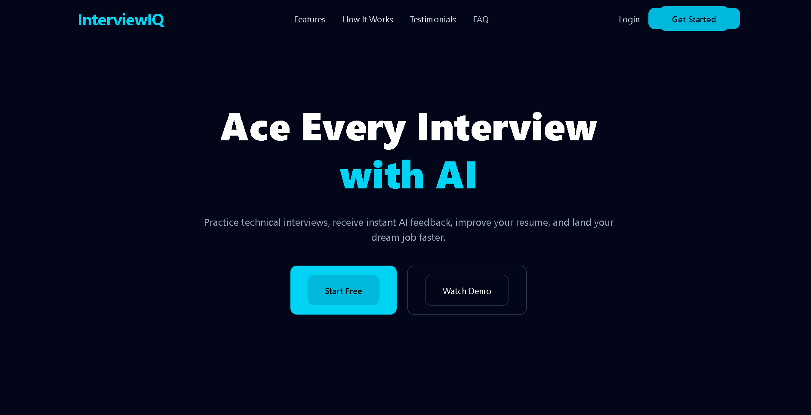
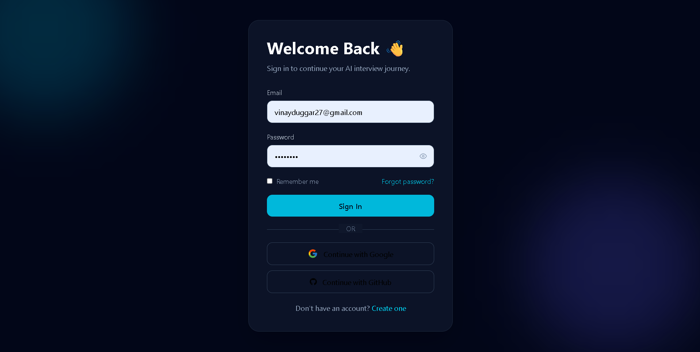
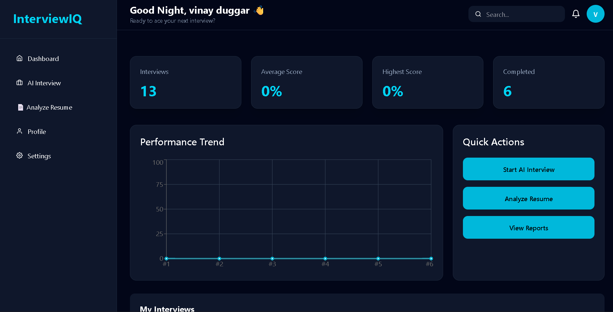
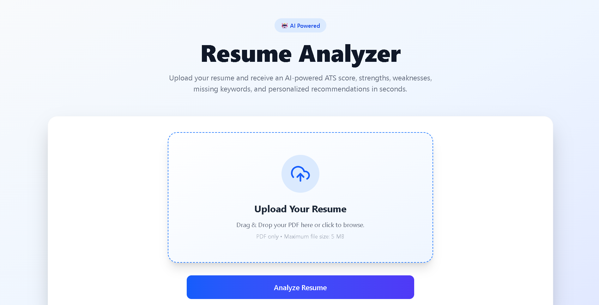
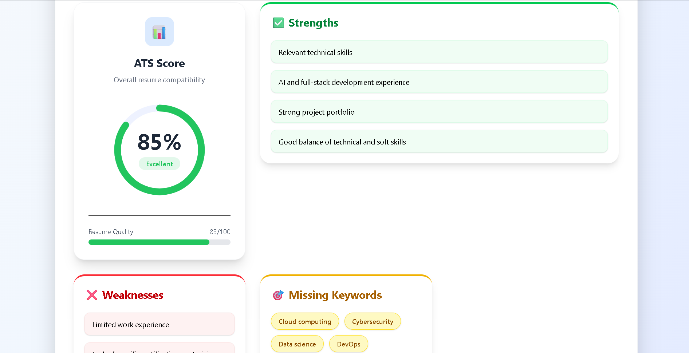
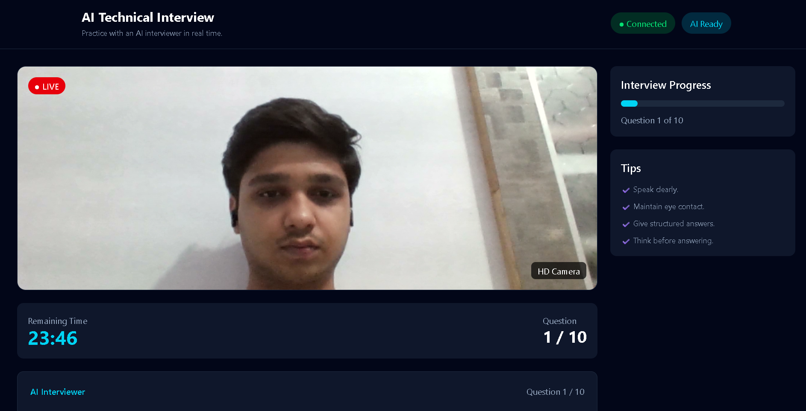
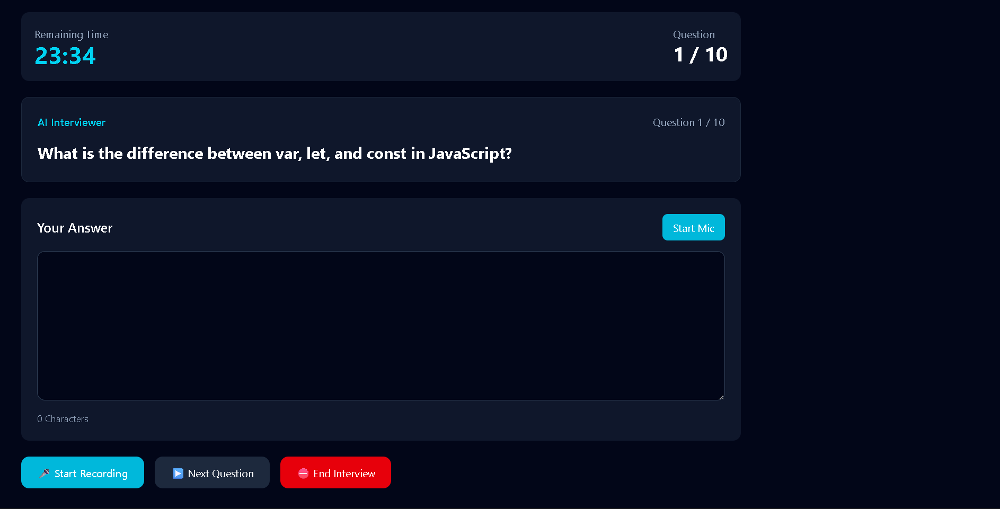
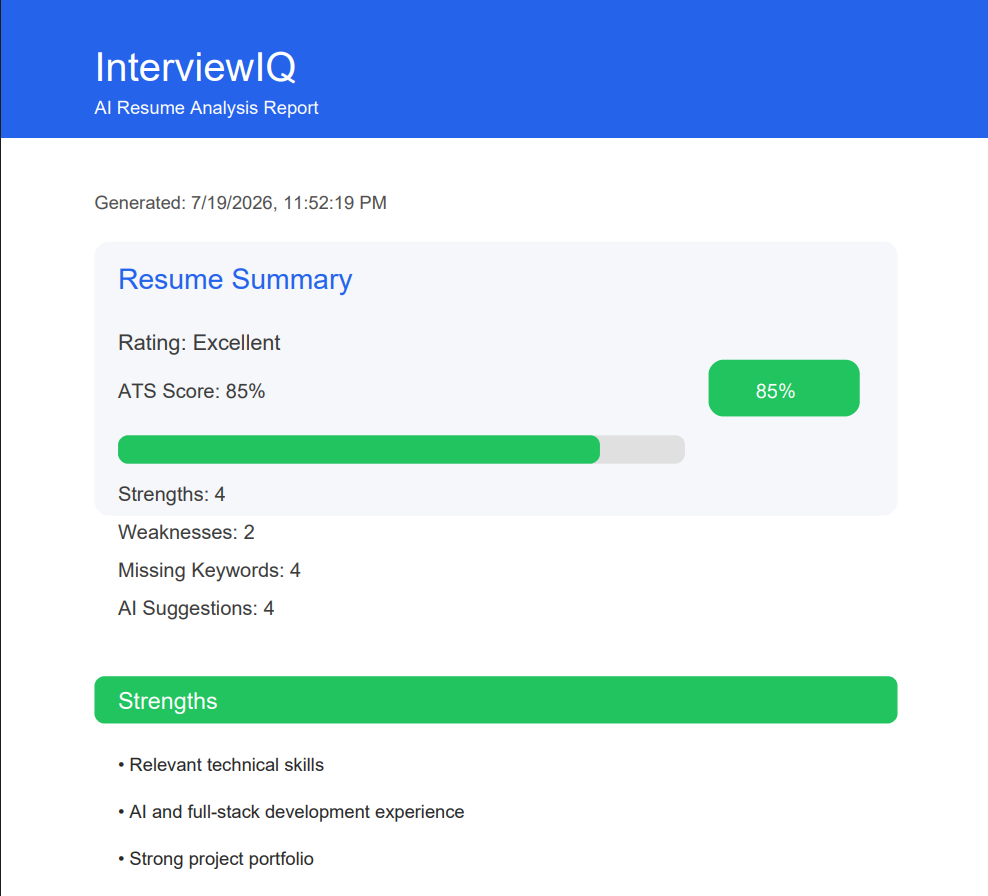

# 🤖 InterviewIQ

<div align="center">

# AI-Powered Interview Preparation Platform

### Transform Your Resume. Practice Smarter. Ace Every Interview.

InterviewIQ is a modern full-stack AI platform that helps students and professionals improve their resumes, prepare for technical interviews, and receive intelligent AI-powered feedback using Large Language Models (LLMs).

<p>


</p>

⭐ AI Resume Analysis • ATS Score • Mock Interviews • Speech Recognition • PDF Reports • Performance Analytics

</div>

---

# 📖 Overview

InterviewIQ is a production-ready AI-powered interview preparation platform developed using modern web technologies.

The platform helps job seekers improve every stage of the hiring process by combining AI Resume Analysis, ATS Compatibility Checking, AI Mock Interviews, Performance Tracking, Interactive Dashboards, and Professional Resume Reports into one seamless application.

Instead of using multiple websites for resume checking, interview practice, and career guidance, InterviewIQ provides everything in one unified platform powered by Artificial Intelligence.

---

# 💡 Why InterviewIQ?

Preparing for interviews usually requires multiple tools:

- Resume Analyzer
- ATS Checker
- Mock Interview Platform
- AI Feedback System
- Performance Tracker

InterviewIQ combines all of these into one intelligent application, making interview preparation faster, smarter, and more personalized.

---

# ✨ Key Highlights

- 🤖 AI Resume Analysis
- 📊 ATS Score Generation
- 🎤 AI Mock Interviews
- 🧠 Groq AI Integration
- 🎙️ Speech Recognition
- 📄 Professional PDF Report Export
- 🔐 JWT Authentication
- 🗄️ PostgreSQL Database
- ⚡ Prisma ORM
- 📱 Responsive Dashboard
- 🎨 Modern UI with Tailwind CSS
- 📈 Interview Performance Analytics

---

# 🚀 Features

## 🤖 AI Resume Analyzer

InterviewIQ analyzes resumes using Artificial Intelligence and provides detailed insights for improvement.

### Features

- Upload Resume (PDF)
- AI Resume Analysis
- ATS Compatibility Score
- Resume Strength Detection
- Resume Weakness Detection
- Missing Keyword Identification
- Personalized Suggestions
- Executive Resume Summary
- Animated ATS Score Visualization
- Professional Report Generation

---

## 📄 Professional PDF Report

Generate a beautifully designed downloadable report containing:

- ATS Score
- Resume Rating
- Resume Summary
- Strengths
- Weaknesses
- Missing Keywords
- AI Suggestions
- Executive Summary
- Progress Visualization
- InterviewIQ Branding
- Automatic Page Breaks
- Footer & Page Numbers

---

## 🎯 AI Mock Interview

Users can create customized interviews by selecting:

- Job Role
- Experience Level
- Company
- Technology Stack

InterviewIQ uses Groq AI to generate intelligent interview questions tailored to the selected role.

---

## 🎤 Interview Features

- AI Generated Questions
- Live Speech Recognition
- Camera Preview
- Answer Recording
- Interview Timer
- AI Answer Evaluation
- Performance Feedback
- Interview Analytics

---

## 📊 Dashboard

The Dashboard provides an overview of interview preparation progress.

### Includes

- Total Interviews
- Average Performance Score
- Resume Analysis Summary
- Recent Activity
- AI Recommendations
- Quick Actions
- Progress Analytics

---

# 🏗️ System Architecture

```text
                    ┌────────────────────┐
                    │     React + Vite    │
                    │   TypeScript Client │
                    └──────────┬──────────┘
                               │
                         REST API Calls
                               │
                               ▼
                    ┌────────────────────┐
                    │ Express + Node.js  │
                    │    Backend API     │
                    └───────┬─────┬──────┘
                            │     │
                Prisma ORM  │     │  Groq AI API
                            │     │
                            ▼     ▼
                  PostgreSQL     AI Models
                       │
                       ▼
                 Application Data
```

---

# 🛠️ Tech Stack

## Frontend

- React
- TypeScript
- Tailwind CSS
- Vite
- Axios
- React Router DOM

---

## Backend

- Node.js
- Express.js
- TypeScript
- JWT Authentication
- REST APIs

---

## Database

- PostgreSQL
- Prisma ORM

---

## Artificial Intelligence

- Groq AI
- Llama 3.3 70B Versatile

---

## Utilities

- pdf-parse
- jsPDF

---

# 📂 Project Structure

```text
InterviewIQ
│
├── client
│   ├── src
│   │   ├── assets
│   │   ├── components
│   │   ├── hooks
│   │   ├── pages
│   │   ├── services
│   │   ├── utils
│   │   └── types
│   │
│   ├── public
│   └── package.json
│
├── server
│   ├── controllers
│   ├── middleware
│   ├── prisma
│   ├── routes
│   ├── services
│   ├── utils
│   ├── app.ts
│   └── package.json
│
└── README.md
```

---

# 🌐 API Overview

| Method | Endpoint | Description |
|---------|----------|-------------|
| POST | `/api/auth/register` | Register a new user |
| POST | `/api/auth/login` | Authenticate user |
| GET | `/api/interviews` | Get all interviews |
| POST | `/api/interviews` | Create a new AI interview |
| GET | `/api/interviews/:id` | Fetch interview details |
| POST | `/api/resume/analyze` | Analyze uploaded resume |

> Authentication is handled using JWT Bearer Tokens for protected routes.

---

# 🔐 Authentication

InterviewIQ uses secure JWT Authentication.

### Features

- User Registration
- User Login
- Password Encryption
- JWT Token Generation
- Protected Routes
- Authorization Middleware
- Secure API Access

---

# 📄 Resume Analysis Workflow

```text
Upload Resume
      │
      ▼
PDF Parsing
      │
      ▼
Extract Resume Text
      │
      ▼
Send Data to Groq AI
      │
      ▼
Generate

• ATS Score
• Resume Summary
• Strengths
• Weaknesses
• Missing Keywords
• AI Suggestions

      │
      ▼
Interactive Dashboard
      │
      ▼
Generate Professional PDF Report
```

---

# 🎤 AI Interview Workflow

```text
Create Interview
       │
       ▼

Select

• Role
• Company
• Experience
• Tech Stack

       │
       ▼

Generate AI Questions

       │
       ▼

Candidate Answers

       │
       ▼

AI Evaluation

       │
       ▼

Performance Dashboard
```

---

# 📈 ATS Score Evaluation

InterviewIQ evaluates resumes using multiple factors including:

- Resume Structure
- Technical Skills
- Keywords
- Education
- Experience
- Projects
- Certifications
- ATS Compatibility
- Formatting Quality

---
# 🎨 User Interface Highlights

InterviewIQ is designed with a modern, responsive, and user-friendly interface to deliver a smooth interview preparation experience across devices.

### UI Features

- 🎨 Modern Gradient Design
- 📱 Fully Responsive Layout
- 🖱️ Drag & Drop Resume Upload
- ⚡ Animated Loading Screens
- 📊 Interactive Dashboard
- 📈 Circular ATS Progress Indicator
- 🎯 Professional Cards
- 🌙 Clean & Minimal Interface
- 🚀 Smooth Animations
- 💻 Mobile & Desktop Friendly

---

# 📄 Professional PDF Report

After analyzing the resume, InterviewIQ generates a professional AI-powered PDF report.

### Report Includes

- Executive Summary
- Resume Rating
- ATS Compatibility Score
- Resume Strengths
- Resume Weaknesses
- Missing Keywords
- AI Recommendations
- Progress Visualization
- Automatic Pagination
- Footer with Page Numbers
- InterviewIQ Branding

---

# 🧠 AI Features

InterviewIQ leverages Large Language Models (LLMs) through **Groq AI** to provide intelligent interview preparation.

### AI Capabilities

- Resume Understanding
- ATS Analysis
- Resume Scoring
- Missing Keyword Detection
- Personalized Suggestions
- Interview Question Generation
- AI Answer Evaluation
- Performance Feedback

---

# 📊 Dashboard Overview

The Dashboard acts as the central hub for monitoring interview preparation progress.

### Dashboard Modules

- Resume Analysis
- ATS Score
- Interview Statistics
- AI Recommendations
- Recent Activities
- Quick Actions
- Performance Overview
- Progress Tracking

---

# 🔄 Application Flow

```text
                User Login
                     │
                     ▼
               Dashboard
                     │
      ┌──────────────┴──────────────┐
      │                             │
      ▼                             ▼
Resume Analyzer               AI Interview
      │                             │
      ▼                             ▼
Upload Resume               Create Interview
      │                             │
      ▼                             ▼
Groq AI Analysis        AI Question Generation
      │                             │
      ▼                             ▼
Resume Report            AI Evaluation
      │                             │
      └──────────────┬──────────────┘
                     ▼
              Performance Dashboard
```

---

# ⚙️ Installation

## Clone the Repository

```bash
git clone https://github.com/Vinayduggar27/InterviewIQ.git
```

Navigate to the project directory.

```bash
cd InterviewIQ
```

---

# 📦 Install Dependencies

## Frontend

```bash
cd client
npm install
```

## Backend

```bash
cd ../server
npm install
```

---

# 🔑 Environment Variables

Create a `.env` file inside the **server** directory.

```env
PORT=5000

DATABASE_URL=your_postgresql_database_url

JWT_SECRET=your_jwt_secret

GROQ_API_KEY=your_groq_api_key
```

---

# ▶️ Running the Application

## Start Backend

```bash
cd server

npm run dev
```

---

## Start Frontend

```bash
cd client

npm run dev
```

---

The application will run on:

```text
Frontend : http://localhost:5173

Backend  : http://localhost:5000
```

---

# 📸 Screenshots

## 🏠 Landing Page

<p align="center">
  
  
</p>

## 📊 Dashboard & Resume Analyzer

<p align="center">
  
  
  
</p>

## 🎤 AI Interview & PDF Report

<p align="center">
  
   
  
</p>

---

# 🚀 Future Enhancements

Some planned improvements include:

- 💻 AI Coding Interview Mode
- 🎯 Company Specific Interview Sets
- 🎤 Voice-Based Interviews
- 📹 Interview Recording
- 🌙 Dark Mode
- 📚 Resume Version History
- 📊 Admin Dashboard


---

# 🤝 Contributing

Contributions are always welcome!

### Steps

1. Fork the repository

2. Create a feature branch

```bash
git checkout -b feature/your-feature
```

3. Commit your changes

```bash
git commit -m "feat: add your feature"
```

4. Push the branch

```bash
git push origin feature/your-feature
```

5. Open a Pull Request 🚀

---

# 📝 License

This project is licensed under the **MIT License**.

You are free to use, modify, and distribute this project under the terms of the MIT License.

---

# 👨‍💻 Author

## Vinay Duggar

**B.Tech Computer Science Engineering**  
**BML Munjal University**

### Connect with Me

- 💼 LinkedIn: https://www.linkedin.com/in/vinay-duggar/
- 💻 GitHub: https://github.com/Vinayduggar27
- 📧 Email: vinayduggar27@gmail.com

---

# ⭐ Support

If you found this project useful, please consider giving it a **Star ⭐** on GitHub.

Your support motivates future improvements and helps others discover the project.

---

# 🙏 Acknowledgements

Special thanks to the open-source community and the amazing technologies that made this project possible.

- React
- TypeScript
- Node.js
- Express.js
- PostgreSQL
- Prisma ORM
- Tailwind CSS
- Groq AI
- jsPDF
- pdf-parse

---

<div align="center">

# ⭐ Thank You for Visiting!

### If you like this project, don't forget to ⭐ star the repository.

Made with ❤️ by **Vinay Duggar**

**InterviewIQ — Empowering Careers with Artificial Intelligence**

</div>
